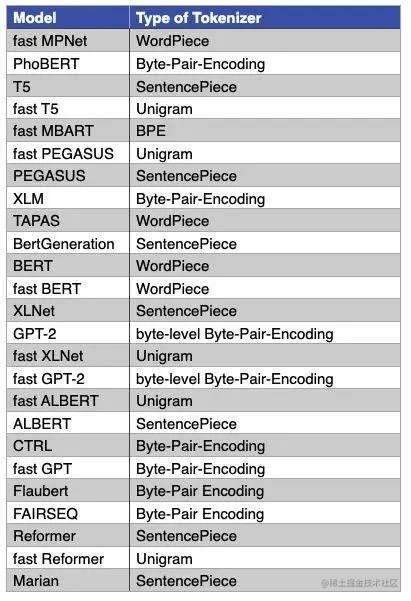

## Transformer相关

Transformer结构与工作原理

- **编码器-解码器结构**：由N个堆叠的编码器和解码器层构成（原论文N=6）。
  - **编码器**：每层含**多头自注意力**和**前馈网络**，子层间通过**残差连接**和**层归一化**连接。
  - **解码器**：比编码器多一个**编码器-解码器注意力层**，且自注意力层使用**掩码**防止信息泄露。

- **优势**：
  - 并行计算效率高，优于RNN的序列依赖。
  - 自注意力全局建模，长距离依赖处理能力强。
- **局限**：
  - 计算复杂度随序列长度呈平方级增长（O(n²)）。
  - 位置编码对相对位置关系的建模仍有改进空间。

Self-Attention 机制的理解

Self-Attention 是 Transformer 的核心组件，旨在捕捉序列内部的长程依赖关系。其核心思想是通过计算序列中每个位置与其他位置的关联权重（注意力分数），动态调整各位置对当前处理的贡献。

注意力机制的Q,K,V是怎么获得的、QKV分别都是什么？为什么要除以$\sqrt{d_k}$

Q, K, V是输入向量x通过分别与$W_q$、$W_k$ 、$W_v$ 矩阵相乘（线性变换）后得到的。每个输入向量通过线性变换生成三组向量：

- **Query（Q）**：当前处理的“询问”向量，用于匹配其他位置。
- **Key（K）**：其他位置的“标识”向量，用于被 Query 匹配。
- **Value（V）**：实际携带信息的向量，用于加权聚合。

除以$\sqrt{d_k}$是为了避免因权重过大导致的梯度爆炸现象，对注意力矩阵进行归一化。


如何通过并行加速训练

- 数据并行 (Data Parallesim)：将 **同一批次数据** 分割到多个设备（如GPU），每个设备持有 **完整模型副本**，独立计算梯度后同步聚合。

  单机多卡的实现：

  ```python
  model = nn.DataParallel(model, device_ids=[0, 1, 2])  # 自动分配数据到多GPU
  outputs = model(inputs)
  loss = criterion(outputs, labels)
  loss.backward()  # 梯度自动聚合到主GPU
  ```

  多机多卡的实现：

  ```python
  # 初始化进程组
  torch.distributed.init_process_group(backend='nccl')
  model = DDP(model, device_ids=[local_rank])  # 每个进程独立模型副本
  
  # 数据分片
  sampler = DistributedSampler(dataset)
  dataloader = DataLoader(dataset, sampler=sampler)
  for inputs in dataloader:
      outputs = model(inputs)
      loss.backward()  # 梯度自动All-Reduce同步
  ```

  **优点**：实现简单，适合模型参数可单卡容纳的场景。
  **缺点**：显存占用高（每个设备需存储完整模型），无法处理超大模型。

- 模型并行（Model Parallelism）: 将 **模型拆分到不同设备**，每个设备负责计算部分网络层，通过设备间通信传递中间结果。

​	**优点**：支持超大规模模型训练（如GPT-3）。
​	**缺点**：设备间通信开销大，需要手动设计拆分策略。

- 流水线并行（Pipeline Parallelism）: 将 **模型按层切分为多个阶段（Stage）**，每个阶段部署到不同设备，通过微批次（Micro-batch）并行处理数据流。

​	**优点**：降低单个设备显存压力，提高设备利用率。
​	**缺点**：需要平衡各阶段计算时间，避免流水线气泡（Bubble）。

- 混合并行（Hybrid Parallelism）: **结合数据并行+模型并行+流水线并行**，典型应用于千亿参数模型（如Megatron-LM、DeepSpeed）
  1. **数据并行组**：横向扩展，处理不同数据子集。
  2. **张量模型并行组**：纵向拆分模型参数（如矩阵分块）。
  3. **流水线并行组**：按层分阶段处理。

大模型训练过程中常见的优化难题有哪些？梯度消失、过拟合、内存瓶颈等问题，以及梯度累计、混合精度训练等解决方案

- **显存瓶颈**
  - **问题**：模型参数量大（如GPT-3的175B参数），导致单卡显存无法容纳。
  - **解决方案**：
    - **混合精度训练**：使用FP16或BF16降低显存占用，结合梯度缩放避免下溢。
    - **梯度检查点（Gradient Checkpointing）**：牺牲计算时间换显存，反向传播时重新计算部分中间激活值。
    - **模型并行**：将模型切分到多设备（如Megatron-LM的张量并行）。
- **通信开销**
  - **问题**：分布式训练中梯度同步（数据并行）或跨设备通信（模型并行）的延迟成为瓶颈。
  - **解决方案**：
    - **异步通信**：重叠计算与通信（如PyTorch的`DistributedDataParallel`）。
    - **优化通信拓扑**：使用NCCL、Ring AllReduce等高效通信算法。

- **计算效率**
  - **问题**：Transformer的矩阵计算复杂度随序列长度呈平方增长（如自注意力机制为O(n2d)*O*(*n*2*d*)）。
  - **解决方案**：
    - **稀疏注意力**：限制注意力范围（如Longformer的局部窗口）。
    - **算子融合**：将多个操作合并为单一内核（如FlashAttention优化显存访问）。
- **内存效率**
  - **问题**：中间激活值占用显存（如Transformer层的输出需保存以供反向传播）。
  - **解决方案**：
    - **激活重计算（Activation Recomputation）**：反向传播时动态重新计算激活值（牺牲约30%计算时间）。
    - **内存优化框架**：如DeepSpeed的ZeRO（Zero Redundancy Optimizer）分阶段优化参数存储。
- **学习率调优**
  - **问题**：大模型对学习率敏感，不当设置可能导致训练发散或停滞。
  - **解决方案**：
    - **学习率预热（Warmup）**：逐步增加学习率（如Transformer的线性预热）。
    - **自适应优化器**：使用AdamW、LAMB等自适应算法，缓解梯度稀疏性问题。
- **梯度问题**
  - **问题**：梯度消失/爆炸（尤其深层模型）、梯度数值不稳定（混合精度下）。
  - **解决方案**：
    - **梯度裁剪（Gradient Clipping）**：限制梯度幅值。
    - **权重初始化**：采用T-Fixup、Scaled Initialization等适配大模型的初始化策略。
- **数据质量与规模**
  - **问题**：海量数据清洗困难，噪声数据影响模型性能。
  - **解决方案**：
    - **数据去重与过滤**：通过MinHash等算法去除重复文本，过滤低质量内容。
    - **课程学习（Curriculum Learning）**：逐步增加数据复杂度。
- **数据多样性不足**
  - **问题**：数据分布偏差导致模型泛化能力差。
  - **解决方案**：
    - **多领域混合采样**：平衡不同领域数据比例（如PaLM的多语种混合）。
    - **合成数据增强**：通过回译、模板生成等方式扩展数据。
- **并行策略选择**
  - **问题**：模型并行、流水线并行、数据并行的组合复杂度高。
  - **解决方案**：
    - **混合并行**：如Megatron-DeepSpeed结合张量并行、流水线并行和数据并行。
    - **流水线优化**：通过微批次（Micro-batching）减少流水线气泡（Bubble）。
- **负载均衡**
  - **问题**：设备间计算量不均导致资源闲置。
  - **解决方案**：
    - **动态负载分配**：根据设备算力动态调整切分策略。
    - **自动切分工具**：使用FlexFlow等框架自动优化并行策略。

预训练和微调： 如何理解大模型的预训练和微调过程？预训练任务有哪些类型？

- **预训练**: 通过大规模无标注数据，让模型学习通用的语言表示（Language Representation），捕捉词汇、句法、语义和知识。
- **微调（Fine-tuning）**: 在预训练模型的基础上，使用少量标注数据适配特定下游任务（如分类、问答）。

预训练任务:

- ##### **语言建模（Language Modeling, LM）**：根据上下文预测下一个词（自回归模型）或中间词（双向模型）。GPT、BERT

- ##### **序列到序列建模（Seq2Seq LM）**： 基于编码器-解码器结构，学习重构输入序列。T5、BART

- ##### **对比学习（Contrastive Learning）**： 通过对比正样本（相似文本）和负样本（不相似文本）优化表示.

- #####  **多模态预训练**：对齐文本与其他模态（如图像、音频）的表示。CLIP、Whispeer


## Difussion模型相关

扩散模型（Diffusion Models）是一种生成模型，其核心思想是通过模拟数据逐渐被噪声破坏（前向扩散）和从噪声中逐步重建数据（反向去噪）的过程来生成样本。以下是其原理、训练和推理的详细说明：

---

### **一、扩散模型的原理**

#### **1. 前向扩散过程（Forward Process）**
- **目标**：将数据（如图像）逐步添加噪声，最终转化为纯高斯噪声。
- **数学描述**：  
  给定初始数据分布 $ x_0 \sim q(x_0) $，前向过程是一个马尔可夫链，每一步添加高斯噪声：  
  $$
  q(x_t | x_{t-1}) = \mathcal{N}(x_t; \sqrt{1-\beta_t} x_{t-1}, \beta_t \mathbf{I})
  $$
  
  其中 $\beta_t \in (0,1)$噪声调度参数，控制每一步的噪声强度。  
- **简化公式**：通过累积多个时间步，可以直接从 \( x_0 \) 计算 \( x_t \)：  
  $$
  x_t = \sqrt{\alpha_t} x_0 + \sqrt{1-\alpha_t} \epsilon, \quad \epsilon \sim \mathcal{N}(0, \mathbf{I})
  $$
  其中 $\alpha_t = \prod_{i=1}^t (1-\beta_i)$。

#### **2. 反向去噪过程（Reverse Process）**
- **目标**：学习一个神经网络 $\epsilon_\theta$来逐步去噪，从噪声 $ x_T \sim \mathcal{N}(0, \mathbf{I}) $重建原始数据 $ x_0 $。

- **数学描述**：  
  反向过程也是一个马尔可夫链，每一步的分布为：  
  
- $$
  p_\theta(x_{t-1} | x_t) = \mathcal{N}(x_{t-1}; \mu_\theta(x_t, t), \Sigma_t \mathbf{I})
  $$
  其中均值 \( \mu_\theta \) 由神经网络预测，方差 \( \Sigma_t \) 通常固定或由调度参数决定。

---

### **二、训练过程**

#### **1. 训练目标**
- **损失函数**：最小化预测噪声与真实噪声的均方误差（MSE）。  
  $$
  \mathcal{L}(\theta) = \mathbb{E}_{t, x_0, \epsilon} \left[ \| \epsilon - \epsilon_\theta(x_t, t) \|^2 \right]
  $$
  其中 $ t $ 均匀采样自 $[1, T]$，$\epsilon $ 是前向过程中添加的噪声。

#### **2. 实现步骤**
1. **数据准备**：输入数据 $ x_0 $（如图像）。
2. **噪声调度**：定义 $\beta_t$或 $\alpha_t$ 的调度策略（如线性、余弦）。
3. **随机采样时间步**：随机选择时间步 $ t \in [1, T] $。
4. **加噪**：根据 $ x_t = \sqrt{\alpha_t} x_0 + \sqrt{1-\alpha_t} \epsilon $ 生成带噪样本。
5. **训练网络**：输入 $x_t $ 和时间步 $ t $，神经网络 $ \epsilon_\theta $预测噪声 $\epsilon$，计算损失并反向传播更新参数。

#### **3. 网络结构**
- **U-Net架构**：常用于图像任务，支持多尺度特征提取和跳跃连接。
- **时间步嵌入**：将时间步 $t$ 编码为向量（如正弦位置编码），并输入到网络各层。

---

### **三、推理（生成）过程**

#### **1. 采样步骤**
1. **初始化**：从纯噪声 $ x_T \sim \mathcal{N}(0, \mathbf{I}) $ 开始。
2. **迭代去噪**：从 $ t = T $ 到 $ t = 1 $，逐步生成 $ x_{t-1} $：
   $$
   x_{t-1} = \frac{1}{\sqrt{\alpha_t}} \left( x_t - \frac{1-\alpha_t}{\sqrt{1-\alpha_t}} \epsilon_\theta(x_t, t) \right) + \sigma_t z
   $$
   其中 $ z \sim \mathcal{N}(0, \mathbf{I}) $若 $ t > 1 $，$ \sigma_t $ 为噪声方差。
3. **输出结果**：最终得到生成样本 $ x_0 $。

#### **2. 加速技巧**
- **DDIM（Denoising Diffusion Implicit Models）**：通过确定性采样减少迭代步数。
- **知识蒸馏**：训练轻量级模型模拟多步生成过程。

---

### **四、扩散模型 vs 其他生成模型**

| 特性           | 扩散模型         | GAN                | VAE  |
| -------------- | ---------------- | ------------------ | ---- |
| **训练稳定性** | 高（无对抗训练） | 低（模式崩溃）     | 中等 |
| **生成质量**   | 高（细节丰富）   | 高                 | 中等 |
| **生成速度**   | 慢（需多步迭代） | 快（单步生成）     | 快   |
| **多样性**     | 高               | 中等（易模式崩溃） | 高   |

---

### **五、关键改进与应用**
- **Stable Diffusion**：结合Latent Diffusion，在隐空间操作以减少计算量。
- **Classifier Guidance**：使用分类器增强生成内容的可控性。
- **应用领域**：图像生成、音频合成、分子设计、文本到图像生成（如DALL·E 2）。

---

通过上述原理和步骤，扩散模型能够从噪声中逐步生成高质量数据，尽管生成速度较慢，但其在细节还原和多样性上的优势使其成为生成模型的重要分支。

如何评估AIGC模型生成内容的质量？

图像：

- **Inception Score (IS)**：
  基于分类模型（Inception-v3）评估生成图像的多样性和清晰度（高分类置信度且类别多样时得分高）。
- **Fréchet Inception Distance (FID)**：
  计算生成图像与真实图像在特征空间的分布距离（越低越好）。
- **CLIP Score**：
  利用CLIP模型评估生成图像与文本提示的匹配度（如DALL·E的评估）。
- **LPIPS**：
  衡量生成图像与参考图像的感知相似性（基于深度学习特征）。

文本：

- **BLEU**：基于n-gram匹配，衡量生成文本与参考文本的相似性（常用于机器翻译）。
- **ROUGE**：关注召回率，适用于摘要生成。
- **METEOR**：结合同义词和词干分析，更接近人工评分。
- **BERTScore**：利用BERT模型计算生成文本与参考文本的语义相似度。
- **Perplexity**：衡量语言模型对生成文本的置信度（越低越好）。
- **GPT-4评分**：使用大模型直接对生成内容的质量、连贯性等进行打分（如“从1到10分评分”）。
- **Self-Consistency**：多次生成并比较结果的一致性。

## 分词算法

**Byte-Pair Encoding(BPE) 如何构建词典？**

BPE即字节对编码。其核心思想是从字母开始，不断找词频最高、且连续的两个token合并，直到达到目标词数.

**BBPE跟BPE有什么不同？**

BBPE：BBPE核心思想将BPE的从字符级别扩展到子节（Byte）级别。BPE的一个问题是如果遇到了unicode编码，基本字符集可能会很大。BBPE就是以一个字节为一种“字符”，不管实际字符集用了几个字节来表示一个字符。这样的话，基础字符集的大小就锁定在了256（2^8）。采用BBPE的好处是可以跨语言共用词表，显著压缩词表的大小。而坏处就是，对于类似中文这样的语言，一段文字的序列长度会显著增长。因此，BBPE based模型可能比BPE based模型表现的更好。然而，BBPE sequence比起BPE来说略长，这也导致了更长的训练/推理时间。BBPE其实与BPE在实现上并无大的不同，只不过基础词表使用256的字节集。

**WordPiece跟BPE有什么不同?**

WordPiece算法可以看作是BPE的变种。不同的是，WordPiece基于概率生成新的subword而不是下一最高频字节对。WordPiece算法也是每次从词表中选出两个子词合并成新的子词。BPE选择频数最高的相邻子词合并，而WordPiece选择使得语言模型概率最大的相邻子词加入词表。

**Unigram跟BPE有什么不同？**

它和 BPE 以及 WordPiece 从表面上看一个大的不同是，前两者都是初始化一个小词表，然后一个个增加到限定的词汇量，而 Unigram Language Model 却是先初始一个大词表，接着通过语言模型评估不断减少词表，直到限定词汇量。

**请简要介绍一下SentencePiece**

SentencePiece它是谷歌推出的子词开源工具包，它是把一个句子看作一个整体，再拆成片段，而没有保留天然的词语的概念。一般地，它把空格也当作一种特殊字符来处理，再用BPE或者Unigram算法来构造词汇表。SentencePiece除了集成了BPE、ULM子词算法之外，SentencePiece还能支持字符和词级别的分词。

**主流模型使用的分词算法**




