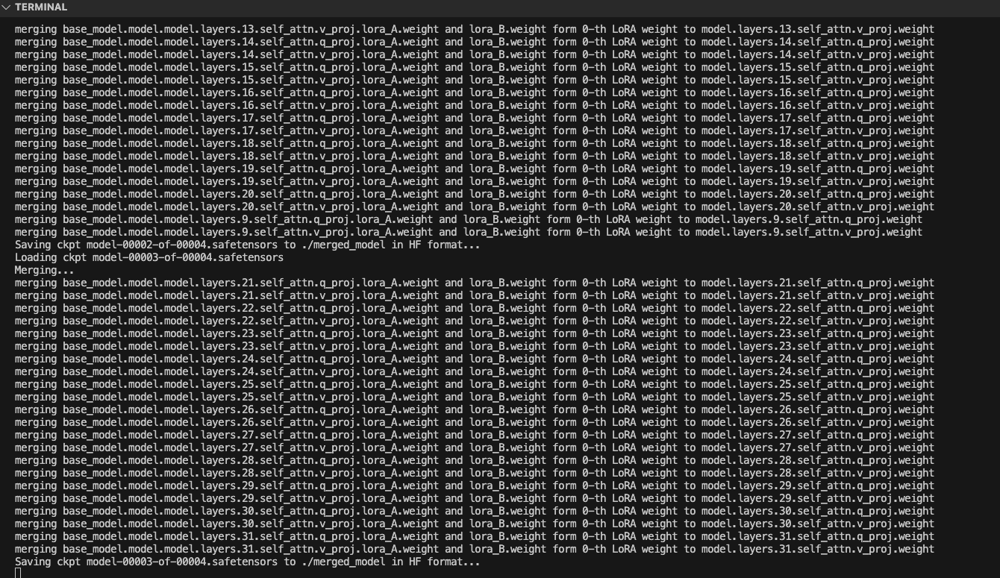
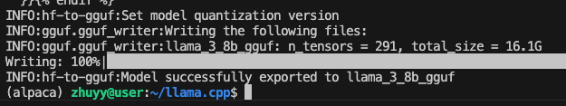
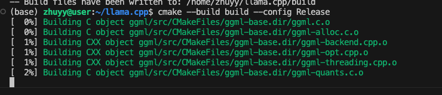
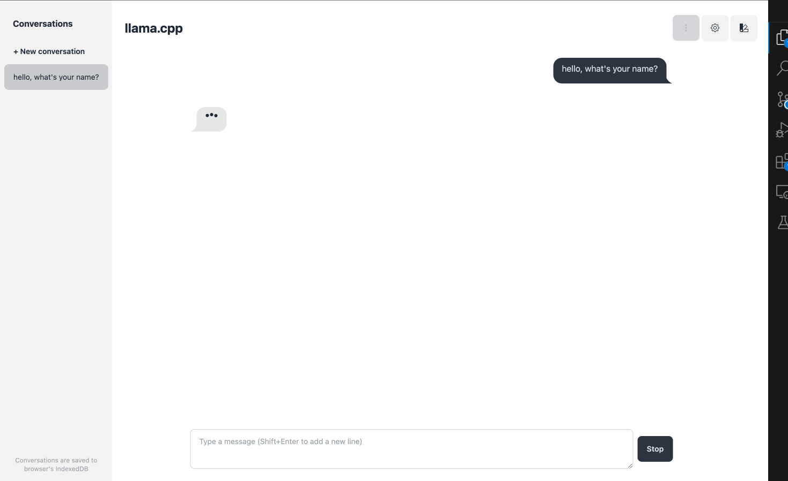

# llama.cpp部署lora微调后的alpaca模型


### 合并lora模型

使用[Chinese-LLaMA-Alpaca](https://github.com/ymcui/Chinese-LLaMA-Alpaca) 仓库下的脚本scripts/merge_llama3_with_chinese_lora_low_mem.py

命令如下：
```shell
python merge_llama3_with_chinese_lora_low_mem.py --base_model /data/share/Meta-Llama-3-8B-Instruct --lora_model ~/stanford_alpaca/output --output_type huggingface --verbose
```



### 转化为gruff

```shell
python convert_lora_to_gguf.py --outfile  ~/stanford_alpaca/gguf_outpsut --outtype bf16 --verbose --base /data/share/Meta-Llama-3-8B-Instruct --lora_path ~/stanford_alpaca/output 
```



转换完成，模型大小为16.1G

## llama.cpp构建

在llama.cpp项目下执行`make`命令报错，报错提示：
```shell
Makefile:2: *** The Makefile build is deprecated. Use the CMake build instead. For more details, see https://github.com/ggml-org/llama.cpp/blob/master/docs/build.md.  Stop.
```

### 安装CMake

1. 在[官网](https://cmake.org/download/)下载CMake压缩包
2. 解压缩

```shell
tar -zvxf ~/cmake-4.0.0-rc3.tar.gz 
```

3. 安装cmake

```
./configure --prefix=/home/xxx/cmake-4.0.0-rc3  -- -DCMAKE_USE_OPENSSL=OFF
```

`-DCMAKE_USE_OPENSSL=OFF ` 用来跳过SSL 支持（仅影响部分功能如 HTTPS 下载）

4. make

```
make -j$(nproc) && make install
```

5. 配置环境变量

```
export PATH="$HOME/xxx/gcc/cmake-4.0.0-rc3:$PATH"
```

### 编译llama.cpp

不同的编译配置请参考[官网](https://github.com/ggml-org/llama.cpp/blob/master/docs/build.md)

**CUDA配置**

```shell
cmake -B build -DGGML_CUDA=ON
cmake --build build --config Release
```

编译过程如下:


编译完成后，运行命令

```shell
# Use `CUDA_VISIBLE_DEVICES` to hide the first compute device.
CUDA_VISIBLE_DEVICES="-0" ./build/bin/llama-server --model /srv/models/llama.gguf
```

chatbot界面：



## 问题

1.LLM推理阶段的参数有哪些，解释一下？

2.llama的中文能力不太行，怎么解决？中文词表扩充怎么做的？

3.LoRA的原理讲一下？为什么LoRA会有效果？LoRA是怎么初始化的？LoRA有哪些参数可以调整？

4.LLM做生成任务是怎么训练的？如果说做代码生成的任务你觉得应该怎么做？

5.LLM的涌现能力是什么原因，说一下你的理解？

**1. LLM推理阶段的参数有哪些，解释一下?** 
LLM推理阶段的核心参数主要用于控制生成结果的多样性和质量，常见参数包括：  

- **Temperature**：控制采样随机性。值越低（接近0），模型越倾向于高概率词（输出更确定）；值越高（如1.0），分布更平滑（输出更随机）。  
- **Top-k**：仅从概率最高的k个词中采样。较小的k会限制多样性，较大的k可能引入噪声。  
- **Top-p (Nucleus Sampling)**：从累计概率超过阈值p的最小词集合中采样，动态调整候选词数量。  
- **Max Length**：生成文本的最大长度限制，避免无限生成。  
- **Beam Search参数**：  
  - **num_beams**：候选序列数量，值越大搜索越全面，但计算量增加。  
  - **length_penalty**：调节生成长度偏好（>1鼓励长文本，<1偏好短文本）。  
- **Repetition Penalty**：抑制重复词（如设置为1.2，重复词概率降低）。  
- **do_sample**：布尔值，决定是否采样（True）或贪心解码（False，选最高概率词）。  

------

**2. Llama中文能力不足，如何解决？中文词表扩充怎么做？**

**参考答案：**  
**解决中文能力不足的方法：**  

1. **继续预训练（Continual Pre-training）**：用大量中文语料（如Wikipedia、新闻、书籍）在Llama基础上训练，调整模型参数。  
2. **指令微调（Instruction Tuning）**：使用中文指令数据集（如Alpaca翻译数据）进行监督微调。  
3. **词表扩充**：直接扩展词表以更好支持中文分词。  

**中文词表扩充步骤：**  
1. **分析现有词表**：统计Llama词表中中文字符/词的覆盖率。  
2. **生成新词表**：  
   - 用中文语料训练新的Tokenizer（如SentencePiece/BPE），或合并现有词表与新词。  
   - 例如：添加常见中文字符、成语、专有名词等。  
3. **调整模型嵌入层**：  
   - 扩展Embedding矩阵，新增中文token的向量可初始化为相近词向量的均值或随机初始化。  
4. **再训练**：在中文语料上继续预训练，使模型适应新词表。  


**3.LoRA的原理？为什么有效？初始化？可调参数？**
**原理：**  
LoRA（Low-Rank Adaptation）通过低秩分解在原始权重旁添加适配器。对于权重矩阵 $W \in \mathbb{R}^{d \times k} $，引入两个低秩矩阵 $A \in \mathbb{R}^{d \times r} $和 $ B \in \mathbb{R}^{r \times k} $，使得前向计算变为：  


$$
h = Wx + BAx
$$
训练时仅更新 $A $ 和 $ B $，冻结原始参数 $W $。  

**有效性原因：**  
- **内在低秩性**：模型适应任务所需参数变化可能集中在低秩空间，少量参数即可捕捉关键信息。  
- **高效性**：参数量远小于全参数微调（如 $r=8 $ 时，参数量减少至原始的0.1%）。  

**初始化方法：**  

- $A $用高斯分布初始化，$B $初始化为零矩阵，确保初始状态 $ BA=0 $，不影响原始模型输出。  

**可调参数：**  
1. **秩（r）**：控制低秩矩阵的维度，r越大能力越强但参数量增加。  
2. **作用层**：通常仅适配Attention层的 \( Q/V \) 矩阵。  
3. **Alpha（α）**：缩放因子，调整 $ BA $ 的贡献（实际训练时学习率需与α协调）。  

------

**4.LLM生成任务训练方法？代码生成任务怎么做？**

**生成任务训练方法：**  

- **自回归训练**：输入前缀序列 $ x_{1:t} $，预测下一个token $ x_{t+1} $，损失函数为交叉熵。  
- **Teacher Forcing**：训练时使用真实历史token，避免错误累积。  

**代码生成任务优化：**  

1. **数据构建**：  
   - 使用代码-注释配对数据（如GitHub代码库）。  
   - 添加代码结构信息（如AST抽象语法树）。  
2. **分词优化**：  
   - 针对代码语法设计Tokenizer（如保留缩进、括号等符号）。  
3. **训练策略**：  
   - 引入语法约束损失（如AST合法性），或在解码阶段约束输出格式。  
   - 结合单元测试结果进行强化学习（RLAIF）。  
4. **后处理**：  
   - 用静态分析工具（如Pyflakes）检查生成代码的语法正确性。  

------

**5.涌现能力**

涌现能力指模型规模达到阈值后突然表现出的能力（如复杂推理），可能原因包括：  

1. **规模效应**：  
   - 参数量的量变引发质变，模型能表征更复杂的函数（如思维链）。  
2. **任务内在复杂性**：  
   - 某些任务需多步推理，小模型缺乏足够容量分解步骤。  
3. **数据中的隐式模式**：  
   - 大模型从海量数据中学习到潜在规律（如代码生成需理解API关联）。  
4. **评估方式偏差**：  
   - 某些能力需特定评测方式（如开放式生成任务）才能显现。  

