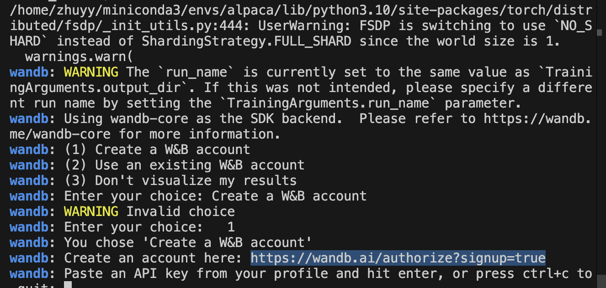
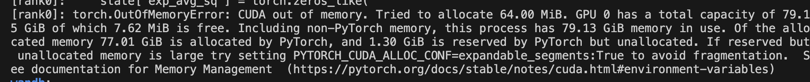

## LLM初学一： 基于alpaca的指令微调 ##

### 更换国内huggingface镜像源

国内用户无法直接访问Hugging Face的问题，可以通过以下多种方法解决，具体方案可根据实际需求选择：

---

### 一、使用镜像站点替换域名
1. **设置环境变量**  
   在代码中通过设置环境变量 `HF_ENDPOINT`，将默认的Hugging Face域名替换为国内镜像站点（如 `hf-mirror.com`），适用于使用Transformers库或Hugging Face Hub的场景：  
   
   ```python
   import os
   os.environ["HF_ENDPOINT"] = "https://hf-mirror.com"
   ```
   此方法需在加载任何Hugging Face库之前执行，可解决模型下载、数据集加载等问题。
   
2. **命令行或Docker配置**  
   在Docker启动命令中添加环境变量：  
   ```bash
   docker run -e HF_ENDPOINT=https://hf-mirror.com ...
   ```
   或在终端中临时设置：  
   ```bash
   export HF_ENDPOINT=https://hf-mirror.com
   # 设置镜像源环境变量
   export HF_ENDPOINT=https://hf-mirror.com
   
   # 通过CLI工具下载完整模型（包含LFS文件）
   huggingface-cli download --resume-download --local-dir-use-symlinks False THUDM/chatglm3-6b
   ```
   确保镜像地址包含 `https://` 前缀，否则可能报错。

---

### 二、国内平台替代
1. **ModelScope（阿里云）**  
   阿里云推出的ModelScope平台提供与Hugging Face类似的模型和数据集资源，支持直接通过Python库调用：  
   ```python
   from modelscope import snapshot_download
   model_dir = snapshot_download('qwen/Qwen-7B-Chat-Int4')
   ```
   安装命令：`pip install modelscope`。

2. **其他国内平台**  
   - **AI Gitee**：提供部分开源模型的托管服务，适合轻量级需求。
   - **异型岛社区版**：支持镜像加速和断点续传，需配合专用下载脚本。

---

### 三、离线下载与本地加载
1. **本地下载后上传服务器**  
   在可访问Hugging Face的设备上下载数据集或模型，保存为本地文件后上传至服务器：  
   
   ```python
   # 下载数据集示例
   dataset = load_dataset('super_glue', 'cb', cache_dir='./raw_datasets')
   dataset.save_to_disk('super_glue_cb')
   # 服务器加载本地文件
   raw_dataset = load_from_disk("./super_glue_cb")
   ```
   此方法适用于数据集下载失败或模型体积较大的场景。
   
2. **手动下载模型文件**  
   通过镜像网站（如 `hf-mirror.com`）直接下载模型文件，代码中指定本地路径加载：  
   ```python
   model = AutoModel.from_pretrained("./model/")  # 本地路径替换远程路径
   ```

### 下载QWen-7B-Chat模型

可以通过以下两种方式从 `hf-mirror.com` 镜像站下载 Qwen-7B 模型：

---

### **方法一：使用 `huggingface-cli` 命令行工具**
1. **安装依赖工具**  
   ```bash
   pip install huggingface_hub  # 安装 huggingface_hub 库
   ```

2. **设置镜像源并下载**  
   通过 `huggingface-cli` 指定镜像站地址下载模型：
   ```bash
   huggingface-cli download \
     --repo-id Qwen/Qwen-7B \              # 模型名称（注意区分版本，如Qwen-7B-Chat）
     --cache-dir ./qwen_model \            # 指定本地保存路径
     --resume-download \                   # 支持断点续传
     --local-dir-use-symlinks False \      # 禁用符号链接
     --endpoint https://hf-mirror.com      # 强制使用镜像站
   ```

---

### **方法二：直接通过 `wget` 或 `git` 下载**
1. **手动拼接镜像地址下载**  
   Qwen-7B 的模型文件在镜像站的路径为：  
   
   ```
   https://hf-mirror.com/Qwen/Qwen-7B/tree/main
   ```
   使用 `wget` 批量下载（需提前安装 `wget`）：
   ```bash
   wget -r -np -nH --cut-dirs=5 -R "index.html*" \
     https://hf-mirror.com/Qwen/Qwen-7B/resolve/main/  # 递归下载所有文件
   ```
   
2. **使用 `git clone`（需安装 Git LFS）**  
   ```bash
   git clone https://hf-mirror.com/Qwen/Qwen-7B  # 镜像站地址直接替换原域名
   ```

---

### **关键注意事项**
1. **模型版本核对**  
   - 确认模型完整名称（如 `Qwen/Qwen-7B` 或 `Qwen/Qwen-7B-Chat-Int4`）。
   - 镜像站模型与官方同步更新，若下载失败可检查路径是否存在。

2. **依赖工具安装**  
   - 若使用 Git 下载，需提前安装 Git LFS：
     ```bash
     git lfs install  # 初始化 Git LFS
     ```

3. **加速下载技巧**  
   - 添加 `-c` 参数使用断点续传（`wget -c`）。
   - 使用多线程工具（如 `axel`）加速：
     ```bash
     axel -n 8 https://hf-mirror.com/Qwen/Qwen-7B/resolve/main/pytorch_model.bin
     ```

---

### **验证下载结果**
1. 检查文件完整性：  
   ```bash
   cd Qwen-7B
   sha256sum -c checksum.sha256  # 对比哈希值（部分模型提供校验文件）
   ```
2. 本地加载测试（Python）：
   ```python
   from transformers import AutoModel
   model = AutoModel.from_pretrained("./Qwen-7B")  # 指定本地路径
   ```

---

### **常见问题**
- **报错 `ConnectionError`**：检查镜像地址是否包含 `https://` 前缀。
- **大文件下载中断**：使用 `--resume-download` 或 `wget -c` 续传。
- **权限问题**：添加 `sudo` 或修改目标目录权限。


训练

```python
torchrun --nproc_per_node=1 --master_port=14456 train.py --model_name_or_path=/data/share/Meta-Llama-3-8B-Instruct  --data_path ./alpaca_data.json --bf16 True --output_dir ./output --num_train_epochs 3 --per_device_train_batch_size 4 --per_device_eval_batch_size 4     --gradient_accumulation_steps 8     --evaluation_strategy "no"     --save_strategy "steps"     --save_steps 2000     --save_total_limit 1     --learning_rate 2e-5     --weight_decay 0.     --warmup_ratio 0.03     --lr_scheduler_type "cosine"     --logging_steps 1     --fsdp "full_shard auto_wrap"     --fsdp_transformer_layer_cls_to_wrap 'LlamaDecoderLayer'     --tf32 True
```

## 无法导入openai_objec错误 ##

#### **降级 OpenAI 库版本**

1. **卸载当前版本**

   ```
   pip uninstall openai
   ```

2. **安装兼容版本**
   选择 `openai<1.0` 的版本（如 `0.28.1`）：

   ```
   pip install openai==0.28.1
   ```

3. **验证是否修复**
   重新运行代码，检查是否仍报错。

### 创建W&B账号



### 用peft框架进行Lora训练

在训练LLaMA-7B时遇到显存不足（OOM）问题，使用**LoRA（Low-Rank Adaptation）**技术可以有效降低显存占用。



LoRA通过在模型的权重矩阵旁添加低秩分解的适配器（Adapter），**只训练新增的小参数量适配器**，冻结原始模型参数。这种低秩更新可将显存占用降低50%~70%。

#### 关键优势：
- **显存优化**：仅需存储适配器梯度，而非全量参数梯度。
- **计算高效**：反向传播仅更新少量参数。
- **效果接近全参微调**：适配器可捕捉任务特定特征。

#### 1. **安装依赖库**
```bash
pip install peft transformers accelerate bitsandbytes
# 可选：安装支持LoRA的最新版库（避免版本冲突）
```

#### 2. **加载模型并注入LoRA适配器**
```python
from transformers import LlamaForCausalLM, LlamaTokenizer
from peft import LoraConfig, get_peft_model

# 加载基础模型（需提前申请LLaMA权重）
model = LlamaForCausalLM.from_pretrained(
    "decapoda-research/llama-7b-hf",
    load_in_8bit=True,  # 8bit量化进一步压缩显存
    device_map="auto"    # 自动分配设备（GPU/CPU）
)
tokenizer = LlamaTokenizer.from_pretrained("decapoda-research/llama-7b-hf")

# 配置LoRA参数
lora_config = LoraConfig(
    r=8,                 # 低秩矩阵的秩（Rank）
    lora_alpha=32,       # 缩放因子（类似学习率）
    target_modules=["q_proj", "v_proj"],  # 对LLaMA的Query和Value投影层添加适配器
    lora_dropout=0.05,   # Dropout概率
    bias="none",         # 不训练偏置项
    task_type="CAUSAL_LM"
)

# 注入LoRA适配器
model = get_peft_model(model, lora_config)
model.print_trainable_parameters()  # 查看可训练参数（通常<1%总参数量）
```

#### 3. **修改训练脚本（关键调整项）**
```python
from transformers import Trainer, TrainingArguments

# 训练参数优化
training_args = TrainingArguments(
    output_dir="./alpaca-lora",
    per_device_train_batch_size=4,   # 根据显存调整（8GB显存建议=2）
    gradient_accumulation_steps=8,    # 梯度累积补偿batch_size不足
    learning_rate=2e-5,              # LoRA学习率通常为全量微调的3~10倍
    num_train_epochs=3,
    logging_steps=10,
    fp16=True,                        # 混合精度训练（A100/V100可开启）
    optim="adamw_torch",              # 使用AdamW优化器
    save_strategy="steps",
    save_steps=500,
    report_to="tensorboard"
)

# 使用Trainer训练（数据加载需适配Alpaca格式）
trainer = Trainer(
    model=model,
    args=training_args,
    train_dataset=train_data,
    data_collator=lambda data: {'input_ids': torch.stack([f[0] for f in data]),
                                'attention_mask': torch.stack([f[1] for f in data]),
                                'labels': torch.stack([f[0] for f in data])}
)
trainer.train()
```

---

### **三、显存优化进阶技巧**

#### 1. **量化加载（8bit/4bit）**
```python
# 4bit量化（需bitsandbytes>=0.39.0）
model = LlamaForCausalLM.from_pretrained(
    "decapoda-research/llama-7b-hf",
    load_in_4bit=True,
    bnb_4bit_compute_dtype=torch.float16  # 计算时使用半精度
)
```

#### 2. **梯度检查点（Checkpointing）**
```python
model.gradient_checkpointing_enable()  # 减少激活值显存，但增加计算时间
```

#### 3. **调整适配器位置**
```python
# 对更多层添加适配器（平衡显存和性能）
target_modules = ["q_proj", "k_proj", "v_proj", "o_proj"]
```

#### 可能存在的问题及建议

#### 1. **显存不足仍存在**
- **降低`batch_size`**：逐步减少至显存不溢出。
- **增加`gradient_accumulation_steps`**：保持总batch_size不变。
- **启用`fp16`/`bf16`混合精度**：需GPU支持。

#### 2. **训练效果不佳**
- **提高秩（`r`值）**：尝试16或32，但会增加显存。
- **扩大适配范围**：在`target_modules`中添加更多层（如所有注意力层）。
- **调整学习率**：LoRA学习率通常为2e-5至1e-4。

参考以下开源项目，适配Alpaca数据格式：
- **官方PEFT示例**：[Hugging Face PEFT LoRA](https://github.com/huggingface/peft/blob/main/examples/causal_language_modeling/peft_lora_clm.ipynb)
- **社区优化版**：[tloen/alpaca-lora](https://github.com/tloen/alpaca-lora)

---

### **总结**
通过LoRA微调，可将LLaMA-7B的训练显存需求从**>24GB**降低至**8~12GB**（RTX 3090/4090可运行）。关键步骤包括：
1. **模型量化加载**（4bit/8bit）
2. **精准选择适配层**（`target_modules`）
3. **梯度累积与混合精度**结合
4. **合理调整batch_size与学习率**

训练完成后，可通过`model.save_pretrained("lora-weights")`单独保存适配器权重，便于后续部署或与其他基模型组合。

## 问题 ##

**ngram language model 是什么**

Ngram language model是一种比较简单的语言模型，它的原理是下一个单词的生成只跟前n个单词有关，为了计算条件概率$P(w_{i+1}|w_i,w_{i-1}, w_{i-2}, ... w_{i-N+1})$，其使用最大似然估计，条件概率的计算公式为：
$$
P(w_{i+1}|w_i,w_{i-1}, w_{i-2}, ... w_{i-N+1}) = \frac{count(w_{i+1},w_i,w_{i-1}, w_{i-2}, ... w_{i-N+1})}{count(w_i,w_{i-1}, w_{i-2}, ... w_{i-N+1})}
$$

------

**Pre-normalization & Post-normalization**

Pre-normalization 是在前向网络/自注意力计算前进行归一化（LayerNormal），如**T5**（文本生成）、**GPT-3**（大规模语言模型）、**Vision Transformer (ViT)**

Post-normalization 是在前向网络/自注意力计算后进行归一化，如**原始Transformer**，**早期BERT**、**RoBERTa**

------

**AdamW优化器**

**AdamW优化器详解**

**1. 核心概念与改进背景**  
AdamW是Adam优化器的改进版本，由Loshchilov & Hutter在2017年提出，主要解决**权重衰减（Weight Decay）与L2正则化在自适应优化器中的耦合问题**。传统Adam将权重衰减与梯度更新合并处理，而AdamW将其解耦，使正则化更符合理论预期。

---

**2. 与Adam的关键区别**  

| **优化器** | **权重衰减处理方式**                     | **正则化效果**               |
| ---------- | ---------------------------------------- | ---------------------------- |
| **Adam**   | 权重衰减融入梯度计算（与学习率耦合）     | 实际衰减量受自适应学习率影响 |
| **AdamW**  | 权重衰减独立于梯度更新（直接作用于参数） | 衰减量稳定，与学习率无关     |

---

**3. 算法优势**  
- ✅ **更稳定的正则化**：避免自适应学习率干扰权重衰减强度，防止过拟合更有效。  
- ✅ **训练鲁棒性**：在大型模型（如Transformer）和大规模数据中表现更稳定。  
- ✅ **超参数解耦**：学习率与权重衰减系数可独立调节，调参更直观。

---

**4. 典型应用场景**  
- **自然语言处理**：BERT、GPT系列等预训练模型。  
- **计算机视觉**：Vision Transformer（ViT）、ResNet等。  
- **推荐系统**：深度协同过滤、大规模稀疏模型。

---

**5. 实现公式（简化版）**  
参数更新步骤：  

1. 计算梯度（与传统Adam相同）  
2. 更新一阶矩（动量）和二阶矩（自适应学习率）  
3. **参数更新**：  
   $$
   \theta_t = \theta_{t-1} - \eta \cdot \frac{\hat{m}_t}{\sqrt{\hat{v}_t} + \epsilon} - \eta \lambda \theta_{t-1}
   其中：
   $$
   
   - $\eta$：学习率  
   - $\lambda$：权重衰减系数  
   - 最后一项为独立于梯度的权重衰减项  

---

**6. 使用建议**  

- **学习率设置**：通常略高于Adam（因权重衰减独立）。  
- **框架支持**：PyTorch（`torch.optim.AdamW`）、TensorFlow（插件实现）。  
- **适用场景**：推荐在需要显式正则化的任务中优先使用，尤其是大模型训练。

---

**总结**  
AdamW通过**解耦权重衰减与梯度更新**，克服了传统Adam的正则化偏差问题，成为现代深度学习（尤其是预训练模型）的默认优化器之一。其稳定性和可解释性使其在复杂模型训练中显著优于Adam。