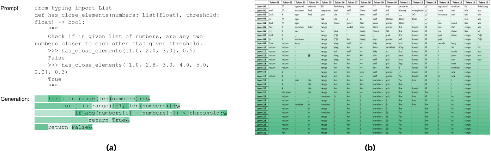

[LayerSkip](https://arxiv.org/abs/2404.16710), [LITE](https://arxiv.org/abs/2310.18581), [LayerDrop](https://arxiv.org/abs/1909.11556), and [Progressive Layer Dropping](https://arxiv.org/abs/2010.13369).

## LayerSkip

### 研究动机

研究动机：基于辅助模型的推测解码虽然可以利用小模型推测、大模型验证来加速推理，但是它们的kv cache不能共享，意味着空间换时间. 本文提出通过自推测来加速模型推理，推理时采用早退机制(Existing Ealier)，在浅层网络提前退出自回归生成草稿tokens,再用剩余的深层网络去验证草稿tokens.

为了使浅层的网络能够自回归地预测下一个token，本文提出了层丢弃（layer droupt）和 早退损失 (early exit loss), 这两个训练策略能使推测阶段的早退机制更加健壮，实际上能过获得也从原始模型中获取有自回归预测下一个token能力的子模型来辅助推测解码过程，提高推理速度。

与用小模型来辅助推测解码不同，自推测解码可以共享kv cache和各层tranformer layers和最终的LM，有降低显存需求的优势。

与SCAN中提出的浅层早退机制相比，LayerSkip需要对原始模型进行预训练、继续训练或微调，会改变原始模型的权重参数。

### 方法

#### 训练

1. 层丢弃(layer dropout)

   有一定的概率p丢弃中间的每一层（1～N-1），且层数越深，丢弃的概率越大，为了使浅层网络的表达能力增强

2. 早退损失(early exit loss)

   为了提高浅层网络的预测准确度，我们必须保证模型的LM head能够正确转换不同的层的输出到词向量，我们需要训练LM head. 我们定义早退损失为
   $$
   J(X,Y,t) = \sum_{l=0}^{l=L-1}\hat{e}(t,l)J_{CE}(g(x_{l+1}), Y)
   $$

其中$\hat{e}(t,l)$是损失缩放因子，随着层数的增加而递增。

#### 推理

推理阶段分为以下三个阶段：

（1）Self-Drafting：在这一阶段我们通过早退机制用浅层网络预测出n个草稿tokens

（2）Self-Verification: 在自验证阶段我们利用整个LLM通过一次前向传播对草稿token进行验证，采纳直到分歧点之前的tokens。 在自我验证阶段，只用通过剩下层计算，这通过共享Kv cache来实现

（3）kv cache用来避免重复计算kv键值对来加速推理。在草稿阶段，我们用前E层进行预测用剩余层进行验证，因此我们可以利用共享kv cache和Exit Query Cache来避免重复计算：

- **Single KV Cache**: 由于草稿模型和验证模型使用相同的层顺序在同一模型上运行，因此前 E 层分两步共享。因此，在草稿阶段，已经计算了前 E 层的 KV 缓存，因此我们能够有效地维护草稿和验证步骤的单个 KV 缓存，从而减少内存和延迟。
- 为了进一步减少前 E 层的计算，我们引入了一个退出查询缓存，它保存退出层 E-1 的查询向量进行验证，以直接从层 E 继续到最后一层 L。至关重要的是，我们只需要为退出层保存查询。我们将 KV 缓存和退出查询的并集称为 KVQ 缓存。

### 结果

该解决方案根据任务实现了 1.34× 和 2.16× 之间的加速。

## Kangaroo

### 研究动机

同样是受推测解码的启发，用LLM的浅层layer作为draft model 来加速LLM的推理。推测解码带来的推理速度提升来自于两方面：1. draft model和目标LLM 的推理速度的差距；2.draft模型推理的token被目标LLM 接受的概率。Medusa通过训练了一个时间无关的（time-independent）多头FFN，放置在最后一层decoder layer 上来做到高效低生成多个draft tokens，但这些draft tokens的接受率却不是很理想。同时，draft model的推理延迟也非常重要，否则会导致端到端的次优(sub-optimal)加速。

因此，本文提出了自回归的自推测模型，通过训练了一个轻量级的adapter module加在LLM的固定浅层上来解码生成draft tokens，浅层网络生成的中间结果可以用剩下的层进行验证来决定要不要接受,draft tokens. 模型架构如下：

主要贡献：

- 我们提出了一种基于双早期退出机制的新型自推测解码框架，名为 Kangaroo。首先，等效自起草小模型从大型LLM的固定浅层提前退出，并连接到适配器网络以生成草稿标记。其次，在起草阶段，Kangaroo 在合适的点使用早期退出来避免在更具挑战性的令牌上不必要的计算开销
- Kangaroo 提供了一种低成本的方法来训练轻量级小型模型。由于自推测草稿模型和大型 LLM 共享一些 KV 缓存和计算，因此实践中唯一的额外部署要求是一个小型适配器网络。
- Spec-Bench[14]上的实验验证了Kangaroo的有效性。在单序列验证下，Kangaroo 在 Spec-Bench 上实现了高达 1.7 倍的加速，优于 Medusa-1，附加参数减少了 88.7%，即与 591M 相比，67M。

###  实验结果

#### 消融实验

## Kangaroo 和 LayerSkip的异同比较

相同点：

1. 动机： 都是受推测解码的启发，结合在中间层的早退机制来作为draft model ，Full Model 来验证draft tokens. 通过压缩LLM的transformer layer数量来达到加速推理的效果
2. 结构上：都共享kv cache和中间计算结果
3. 都需要训练，是基于训练或微调的方法

不同点：

1. kangaroo需要引入额外的adapter module来对中间计算结果进行解码，而LLM则是所有的early exit layers都利用同一个LM 来把hidden states映射到最终的词向量空间
2. kangaroo只更新adapter module的参数，而layerskip是在原始LLM上继续训练和微调

